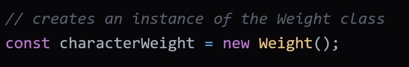

# SSBU Visual (scraper.js file)

## A Super Smash Brothers Frame Data Web Scraper in JavaScript.
## Automatically generates sets of diferent character statistics per request.

### The webscraper is currently not a tool or package, it is a raw JavaScript file (scraper.js). The current statistics that can be pulled are character weight, walk speed, air speed, and initial dash, which will be put into an array of arrays. You can request an array of all the characters, or just ask for a specific character.

# Documentation:
##### The webscraper is objected oriented, meaning you need to create an object of the character data you want, since each set of data has its own class. The reason for multiple classes is because each set of data has its own attributes when being pulled from [ultimateframedata.com](https://ultimateframedata.com/). There is a general class which can univerally parse strings, but in order to get such strings, we need unique classes and methods.

First, create an instance of a class. In this example, we will use character **weight**.

The code above creates an instance of the weight class, which can then be used to pull character weight data.
There is a method in each child class (the classes for different stats), which pulls its data, and creates an array of arrays for each character and their value. So, all we need to do is call this method.

Variable 'result' contains the array of arrays containing the requested character statistics. For example purposes, they are printed in the code above. Below is a portion of the output.

#### Future ideas:
- Create a library for backend use for anyone using JavaScript.
- Created a basic React web application, but further develop it for use.

